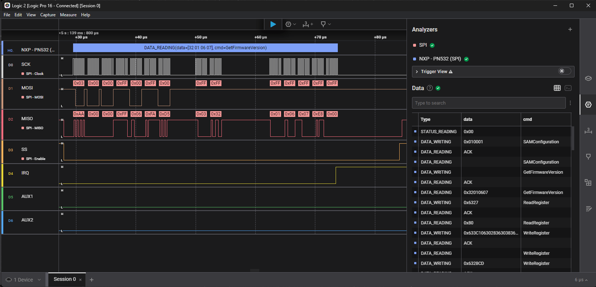

# NXP - PN532 (SPI)
High Level Analyzer for NXP PN532 NFC chip on SPI bus with Saleae Logic analyzer

## SPI settings
- Significant Bit: `LSB`
- Bits per Transfer: `8`
- Clock State: `CPOL = 0`
- Clock Phase: `CPHA = 0`
- Enable Line: `Active Low`

## References
- [https://www.nxp.com/products/rfid-nfc/nfc-hf/nfc-readers/nfc-integrated-solution:PN5321A3HN](https://www.nxp.com/products/rfid-nfc/nfc-hf/nfc-readers/nfc-integrated-solution:PN5321A3HN)
- [https://www.nxp.com/part/PN5321A3HN](https://www.nxp.com/part/PN5321A3HN)
- [https://www.saleae.com](https://www.saleae.com)

## Author
Benjamin DELPY `gentilkiwi`, you can contact me on Twitter ( @gentilkiwi ) or by mail ( benjamin [at] gentilkiwi.com )

## Licence
CC BY 4.0 licence - [https://creativecommons.org/licenses/by/4.0/](https://creativecommons.org/licenses/by/4.0/)